# Note-Taking Flavored MarkDown
Organized thoughts are the only thing standing between you and homelessness

## Contents
  - [Purpose](#purpose)
  - [NTMD Syntax](#ntmd-syntax)
  - [Getting Started](#getting-started)
  - [NotePad Plus Plus](#notepad-plus-plus)
  - [Vim](#vim)

## Purpose
- Simple Syntax Language Optimized for Cyber Note-Taking
- Futureproof Notetaking Technique
- Language Packs Available for Notepad++ and Vim

## NTMD Syntax
### ForCommands
- `$` At the beginning of a line to start a command
- Optional `#` in the middle to end a command and a note 
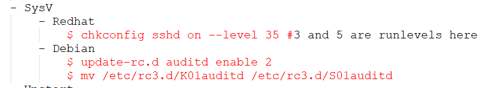

### Definitions
- `>` At the beginning of a line to define a word
- `:` To end the word and begin the definition
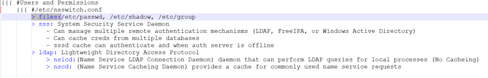

### Code Blocks
- `` ```O `` At the beginning of a line to start a code block
- `` ```C `` At the end of a line to end a code block

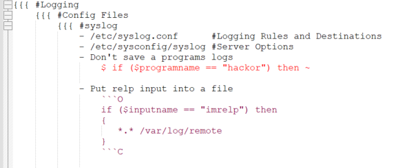

### Tables
- Traditional markdown tables seem to be the most convenient to maintain aswell as remaining visably appealing

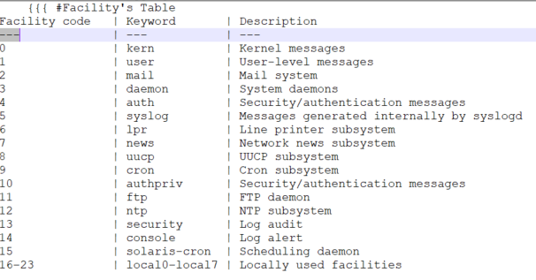

### Folding
- Top folds with `###` and Second folds with `#` still on the first tab (To minimize the amount of tabs needed overall)
- Bottom of folds Tabbed properly and with the corresponding `###` or `#` to easily keep track of relationship 
<!---  -->

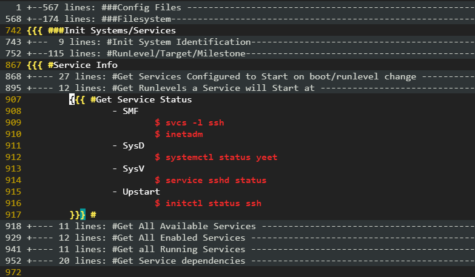

## Getting Started
### NotePad-Plus-Plus
1. Drag your folder of notes into Notepad++ creating a "Workspace"
2. Language > User Defined Language > Define your language...
3. Save As... > Name: `ntmd`
4. Folder & Default tab
  - Ext: `ntmd`
  - Folding in code 2 style > Open: `{{{` Close: `}}}`
5. Operators & Delimiters tab
  - Delimiter 1 style > Open: `$` Close: `((EOL #))`
  - Delimiter 2 style > Open: `>` Close: `((EOL :))`
  - Delimiter 3 style > Open: `` ```O `` > Close: `` ```C ``

<details>
<summary>Example Setup Images</summary>

  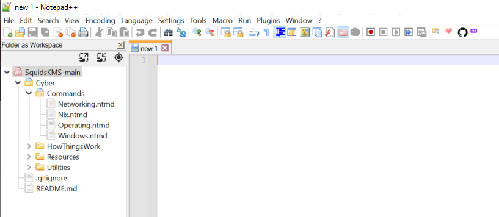

  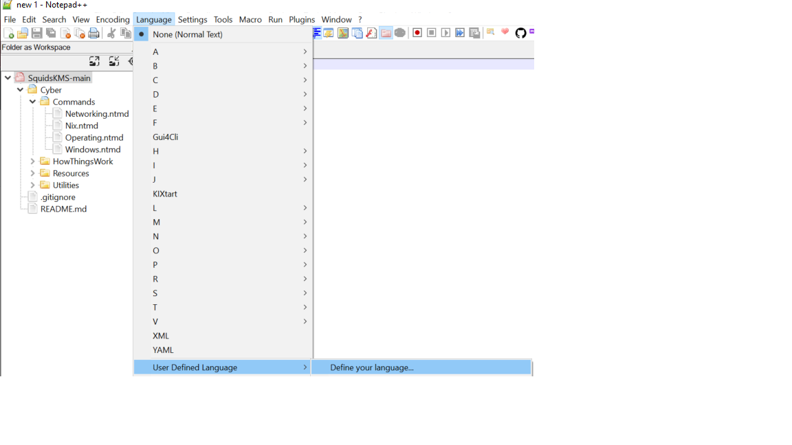
  
  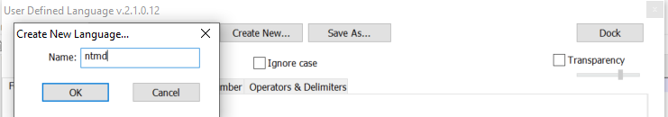
  
  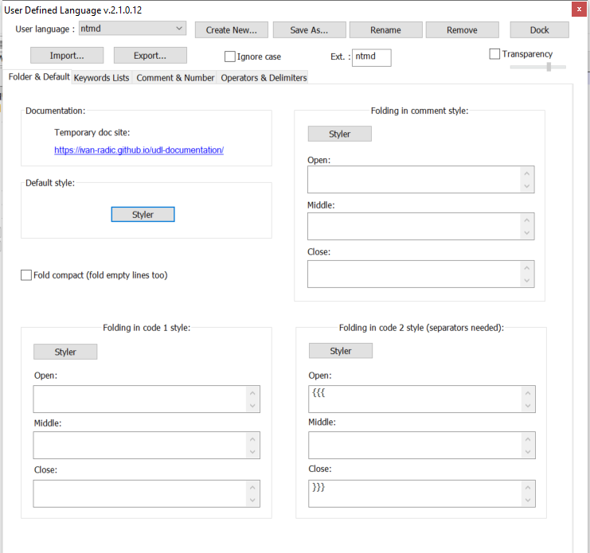
  
  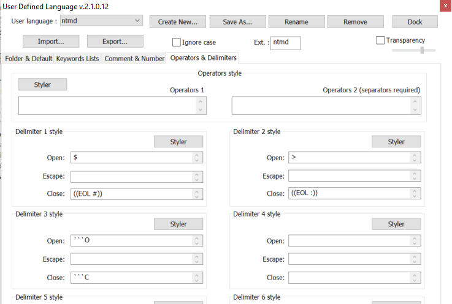
  
</details>
  
### Vim
```
git clone git@github.com:CoolHandSquid/NoteTakingMarkDown
cp KMS_Setup/Vim/vimrc ~/.vimrc
```
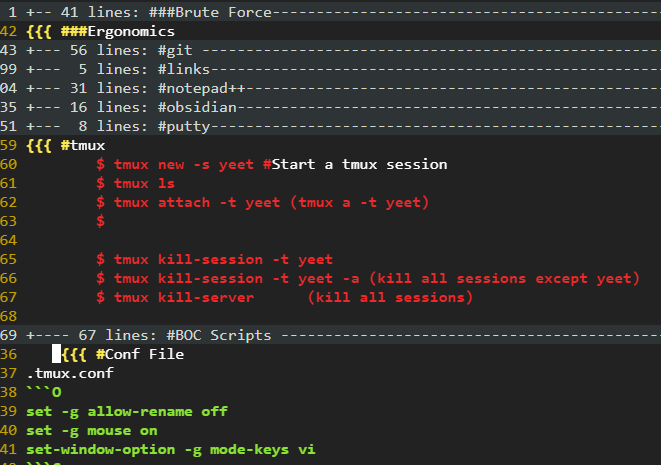
